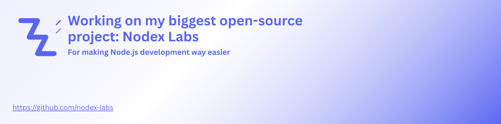

### 👋 Hi, I’m Albert Arakelyan - Passionate Frontend Developer, Mentor, and Open Source Advocate

  
  
  

I’m driven by a love for technology, sharing knowledge, and empowering the next generation of developers.  
With 5+ years of professional experience, I specialize in building web applications using JavaScript and its frameworks, always focusing on best practices, accessibility, and developer experience.

I have also built lots of examples and projects with best practices, which you can use for building your own projects.
And I keep building including open source projects and packages which you can use for yourself or in your projects 🙂.

  
  
  <a href="https://github.com/AlbertArakelyan?tab=repositories">30-d6951c"></a>
  
  
  20-brightgreen">

---

## 🚀 Open Source Highlights 

- **Creator of [AA-Markdown-Library](https://github.com/AlbertArakelyan/AA-Markdown-Library):**  
  A curated, practical resource hub for Markdown guides and developer cheatsheets.
- **Contributor to various projects:**  
    - Sharing best practices, code examples, and helping maintain healthy, collaborative repositories.
    - Creating packages for everyone which solved the problems I faced with at my work.
<!--
- **Champion for “good first issue” and “help wanted” labels:**  
  Making my repos accessible for beginners and encouraging new contributors.
-->

## 📚 Open Source Books & Resources

I maintain a [Books page](https://www.albertarakelyan.com/resources/books) on my website, featuring free PDF content and guides for developers.  
This collection is a customized expansion of my [AA-Markdown-Library](https://github.com/AlbertArakelyan/AA-Markdown-Library), offering additional curated materials.

- Practical guides & cheat sheets
- Exclusive PDF resources
- Helpful for both beginners and advanced devs

I am also planning to have some other types of [Resources](https://www.albertarakelyan.com/resources), such as videos, presentations, talks etc.

*Check it out and let me know what new resources you’d like to see!*

## 🌱 Mentorship & Community Impact

- **Mentored 3 generations of interns** - many now thriving at leading tech companies.
- I actively support newcomers, both in the workplace and through open source, helping them launch their careers and find their confidence.
- I’m always happy to guide anyone through GitHub, whether you are new and need help getting started, or want to contribute to open source for the first time.
- I strive to bring this same spirit to all my projects - welcoming contributors, providing clear guidance, and empowering others to grow and succeed.

---

### 👨‍💻 About me:
- 💼 Frontend Developer & Team Lead (5+ years)
- 🌱 Coach and mentor for junior devs & interns
- 📚 Forever learning: I read tech articles & build pet projects for fun and sharing with everyone
- 🗺️ Building resources for global devs - check [my portfolio](https://www.albertarakelyan.com/resources)
- ✍️ I write [tech blogs](https://www.albertarakelyan.com/blog) & share practical tips from my experience to help other developers grow

<!-- - :arrow_forward: Founder and content creator at [IT Motion](https://www.youtube.com/channel/UCFL-9mlMhhnJ-thUv0JKUtQ) youtube channel -->

### 💻 Tech Stack
I mostly work with **Javascript** and **Typescript**, specifically with **React.js** library. I also work with **Node.js** on backend little bit, also tinkering with **Go** in backend and desktop app development. Familiar with DevOps tools such **Docker** and **CI/CD** (via Github Actions).

<!--  -->
<!--  -->

<!--

  

    &nbsp;
    &nbsp;
    &nbsp;
    &nbsp;
    &nbsp;
    &nbsp;
  

  

      &nbsp;
      &nbsp;
      &nbsp;
      &nbsp;
      &nbsp;
      &nbsp;
      &nbsp;
      &nbsp;
      &nbsp;
  

  

      &nbsp;
      &nbsp;
      &nbsp;
      &nbsp;
      &nbsp;
      &nbsp;
      &nbsp;
  

  

    &nbsp;
    &nbsp;
    &nbsp;
    &nbsp;
    &nbsp;
    &nbsp;
    &nbsp;
    &nbsp;
    &nbsp;
  

  

    &nbsp;
    &nbsp;
    &nbsp;
    &nbsp;
    &nbsp;
    &nbsp;
  

  

    &nbsp;
    &nbsp;
    &nbsp;
    &nbsp;
  

-->

<!--
### 🛠️ Tools :

  

      &nbsp;
    &nbsp;
    &nbsp;
    &nbsp;
    &nbsp;
    &nbsp;
    &nbsp;
    &nbsp;
    &nbsp;
  

  

    &nbsp;
    &nbsp;
    &nbsp;
  

-->

<!--
### 💡 Keen on :

  &nbsp;
  &nbsp;
  &nbsp;
  
  
  
  
  

-->

<h3>
  
  My Portfolio Website:
</h4>

[https://www.albertarakelyan.com](https://www.albertarakelyan.com)

---

### 📝 My Latest Articles:

|   |   |  |   
|---|---|---|
|[How I Learn Effectively: Building Real Needs With New Skills](https://www.albertarakelyan.com/blog/how-i-learn-effectively-building-real-needs-with-new-skills-5)| [5 Challenging Assessments from My Adobe Interview Process](https://www.albertarakelyan.com/blog/5-challenging-assessments-from-my-adobe-interview-process-4)  | [Is There a create-react-app for Node.js? Yes, and Here's How to Use It](https://www.albertarakelyan.com/blog/is-there-a-create-react-app-for-nodejs-3)  | 

---
“I believe in building a welcoming and supportive ecosystem for every developer. Whether you’re just starting or a seasoned pro, let’s grow together! If you need help navigating GitHub or want to get involved in open source, I’m always happy to help.”
